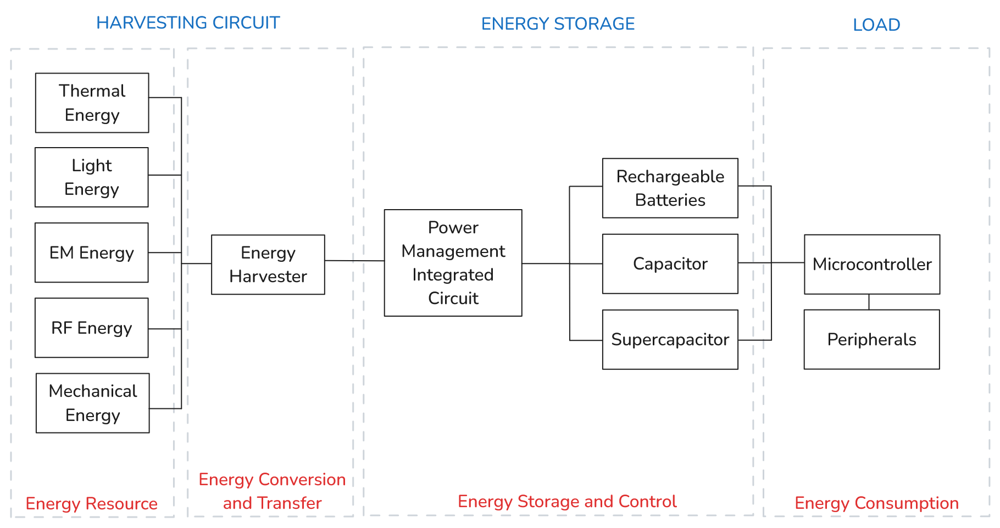

# BEHS Simulation Model

This document serves as wiki for the project.

## Description

> _**Warning:** This project is still under ongoing improvements. The equations that model system components might change in the future._

This project can be used to simulate the energy behaviour of a Battery-less Energy Harvesting System (BEHS).

We assume the following BEHS architecture for developing the simulation model:



The `src` folder contains three sub-folders, one for each sub-system described above.

- `supply` - Represents the _Harvesting Circuit_ sub-system, i.e. the energy harvesting architecture.
    - Implements the `EnergySupply` component class.
- `storage` - Represents the _Energy Storage_ sub-system, i.e. the buffer used to store excess harvested energy.
    - Implements the `EnergyStorage` component class.
- `load` - Represents the _Load_ sub-system, i.e. the load powered by the system.
    - Implements the `Load` component class.

This structure allows users to expand these inheritable classes and define new components of their own, for example:

```python
# Class Load for the BEHS simulation model
# It represents the load, a circuit component that consumes energy from the energy storage
class Load(ABC):
    @abstractmethod
    def __init__(self):
        ...

# Class Resistor for the BEHS simulation model, inheriting from Load Class
class Resistor(Load):
  ...

# Class MCU for the BEHS simulation model, inheriting from Load Class
class MCU(Load):
  ...

# Class ExternalCircuit for the BEHS simulation model, inheriting from Load Class
class ExternalCircuit(Load):
  ...
```

On the `main.py` module, users can instantiate these components, generate a time vector, and study the simulation output. This allows users to observe and understand the energetic behaviour of these components over time.

```python
def main():
    # Generates a time vector
    t_vector = generate_t_vector(start=0, end=60, interval=0.25)

    # Initializes the components of the simulation
    supply = ConstantSupply(t_vector)
    storage = Capacitor()
    load = Resistor()

    # Writes output of simulation to local log file, 'output.log'
    output.write_to_log(t_vector, supply, storage, load)

    # Formats and writes output to local CSV file, 'output.csv'
    output.write_to_csv(t_vector, supply, storage, load)

    # Formats and writes output to local Excel file, 'output.xlsx'
    output.write_to_excel()

    # Reads Excel file and plots the output
    output.plot()
```

The following methods are available on `main.py`:

- `generate_t_vector` - Generates a time vector with a given start, end and interval times.

The following methods are available on module `output.py`:

- `write_to_log` - Writes output of simulation to local log file, 'output.log'.
- `write_to_csv` - Formats and writes output to local CSV file, 'output.csv'.
- `write_to_excel` - Formats and writes output to local Excel file, 'output.xlsx'.
- `plot` - Reads Excel file and plots the output.

This module provides three types of output plotting methods, but users can update the file to create their own and then call them inside the main `plot` method.