# BEHS Simulation Model

# Description

> _**Warning:** The project is still under ongoing improvements. The equations that model system components might change in the future._

Our project provides a simulation framework for analyzing and understanding the energy behaviour of **Battery-less Energy Harvesting Systems** (BEHS).

It was designed to help researchers and professionals in the field of IoT who study and develop energy harvesting applications, such as wireless sensor networks, environmental monitoring systems, wearable electronics, etc.

Users can use the implemented abstract classes inside the `src` folder to simulate a BEHS application. They can extend these classes to define their own components for the system: an energy supply, an energy storage (and its power management integrated circuit), a load, and a hardware/software interface. They can run simulations for different component combinations, and plot graphs to observe the energetic behavior of each sub-system.

The following methods are available on `main.py`:

- `run_manual()` - Loads configuration from `src/input/files/config.json`, runs the simulation and writes all outputs.
- **[WIP]**`run_ui()` - Opens a graphical input form (via `tkinter`) for configuring the simulation, then runs and writes all outputs.

The following methods are available on module `output.py`:

- `write_to_log()` - Writes simulation output to local log file, `output.log`.
- `write_to_csv()` - Writes simulation output to local CSV file, `output.csv`.
- `write_to_excel()` - Reads CSV file and writes output to local Excel file, `output.xlsx`.
- `plot()` - Reads Excel file and plots the output.
   - It provides three default types of plotting methods.
   - Users can update the file to create their own, and add them to the `plot()` method.

# System Scenarios

## Positive Scenario A

A researcher configures the simulation model to compare different energy sources for a wireless temperature monitoring system. 

The first application uses a solar panel as the energy supply, a supercapacitor as the storage, a boost-buck as power management integrated circuit (PMIC), and a microcontroller (MCU) as the load. The interface they have chosen is the most basic one. The time window is a 24-hour simulation with an interval of 1 minute. The goal is to observe daily solar energy cycles. 

For example, the results show that during the day (with constant voltage), the supercapacitor charges efficiently and powers the MCU correctly. Visualization graphs display the MCU's average energy consumption in constrast to the supercapacitor's capacity. This may help to determine the best supercapacitor size needed for operating the application at night. 

Next, the researcher tests a wind energy harvester and compares the output with the solar harvester. This may help them select the optimal energy source for their system.

## Positive Scenario B

A student wants to analyze how different embedded software may impact the same energy storage and load. 

Using the simulation model, they implement their custom MCU component, by inheriting from the Load base class.
They simulate voltage, current and energy consumption values for an MCU with peripherals. Then, they write a program file to execute on that MCU, that periodically wakes, measures data, transmits it, and returns to sleep.

By changing the energy consumption values (i.e. changing for how long the MCU sleeps or sends the data) for different simulations, the user can compare the different outputs and graphs. The results show how differing a programs's energy consumption behaviour affects the capacitor's charging and discharging cycles. 

This may help the student select a suitable storage component for their chosen load.

## Negative Scenario A

A researcher wants to simulate a system with a solar panel and a wind turbine generator working together as the total energy supply.

But, when they try to run the output functions in `main.py`, passing two energy supply components as parameters, they realise the code doesn't work. This happens because, as of now, the simulation only supports one supply, one storage, and one load at a time to configure the input data.

The researcher realizes that to run the simulation with multiple components of the same type would require updating a lot of the core code.

In the end, they have to run the simulation twice (once for each supply) and combine the results themselves.

## Negative Scenario B

A student attempts to simulate a wireless sensor network, where each node periodically transmits and receives data, and then enters a deep sleep mode.

However, they notice that the simulator does not support a load "network" with multiple nodes. Current implementation only works for a single endpoint load device, such as a resistor or a microcontroller (MCU). This means the simulation does not work for a node composed of multiple devices (a node is MCU + peripherals) or a network of multiple nodes.

The student would need to implement this support themselves.

# Technical Documentation

## About

The project is built on a Python (>= 3.13) framework, and to compile it correctly, we recommend that users run the code using a Python virtual environment. Learn more about how to install and activate a virtual environment for your operating system [here](https://realpython.com/python-virtual-environments-a-primer/).

## BEHS Architecture

A **Battery-less Energy Harvesting System** (BEHS) is an IoT-based solution normally destined towards battery-less and/or low-power applications. It harvests natural energy sources from the environment to power its end-use computational devices and electronics.

A BEHS can be decomposed into three sub-systems:

- The *Harvesting Circuit* captures ambient energy and converts it into electrical energy (e.g. solar, wind, mechanical).
- The *Energy Storage* stores excess energy for later use by the system (e.g. capacitors).
- The *Load* is the device being powered (e.g. microcontroller, peripherals).

A fourth component, a *Power Management Integrated Circuit* (PMIC), may also be present, since it helps to control the energy flow between these three sub-systems more efficiently.


## Project Architecture

The `src` folder is organized into the following packages.

### Energy Harvesting Model

- `behs/` - Contains the core BEHS component classes.
   - `energysupply.py` - extends abstract class `EnergySupply` to implement `ConstantSupply` and `HarvestingSupply`.
   - `energystorage.py` - extends abstract class `EnergyStorage` to implement `Capacitor`.
   - `load.py` - extends abstract class `Load` to implement `Resistor` and `MCU`.
   - `pmic.py` - extends abstract class `PMIC` to implement `BoostBuckPMIC`.
- `interface/` - Defines the `Interface` abstract class and its implementations (`Basic`, `Mementos`, `Hibernus`), which functions as a control mechanism between the system's hardware and software.
   - As of now, we only have a mechanism for program execution control, i.e. how the `Load` and `Program` handle power interruptions and state recovery.
   - In the future, we hope to add mechanisms for the energy storage's charge management as well.

This package structure allows users to easily extend the `behs` abstract classes and define new components, for example:

```python
# Class Load for the BEHS simulation model
# It represents the load, a circuit component that consumes energy from the energy storage
class Load(ABC):
    @abstractmethod
    def __init__(self):
        ...

# Class Resistor for the BEHS simulation model, inheriting from Load Class
class Resistor(Load):
  ...

# Class MCU for the BEHS simulation model, inheriting from Load Class
class MCU(Load):
  ...

# Class MCUPeripherals for the BEHS simulation model, inheriting from Load Class
class MCUPeripherals(Load):
  ...
```

### Simulation Setup

- `input/` - Handles simulation input configuration from a JSON file (`src/input/files/config.json`).
- `eh/` - Provides utilities for parsing real Energy Harvesting datasets (e.g. HDF5 or CSV files) into a format suitable for the `EnergySupply` class (if applicable).
- `program/` - Provides utilities for parsing software programs that will be executed by the `Load` class (if applicable). Expects program code to be in a text file format (e.g. `src/program/files/program01.txt`).
- `simulator/` - Contains the function for executing the simulation for the given configurations.
- `output/` - Handles simulation output, such as writing to log, CSV and Excel files, and plotting results.
- **[WIP]** `ui/` - Handles simulation configuration from a user-interface using *tkinter* and integrating with the `input/` package.

The simulation is run via `main.py` using the `run_manual()` function. 

```python
def run_manual():
    # Initializes the simulation input configuration
    config = inp.load_config_from_file(inp.CONFIG_FILE_PATH)

    # Uncomment to generate "profile_filepath" file for EnergySupply (when applicable)
    # File only needs to be generated once, and can be reused for all simulations.
    # inp.set_up_eh_supply_profile_file(config.get("supply"))

    sim_input = inp.Input(config)

    # Run simulation for given input params
    sim_output = simulator.run(sim_input)

    # Write output to local log file, 'output.log'
    out.write_to_log(sim_output)

    # Write output to local CSV file, 'output.csv'
    out.write_to_csv(sim_output)

    # Formats CSV and writes output to local Excel file, 'output.xlsx'
    out.write_to_excel()

    # Reads Excel file and plots the output
    out.plot()
```

The `input` module (`src/input/input.py`) reads the configuration JSON file in `src/input/files/config.json` and instantiates all components. The `simulator` module (`src/simulator/simulator.py`) calls the `run()` function to execute the simulation and returns its output. This output data is then processed by the `output` module (`src/output/output.py`).

Detailed information on how to setup the simulation correctly is available at [this README.md](/src/input/files/README.md).

## Class Diagram

The project is structured according to the class diagram below.

```mermaid
classDiagram
direction TB
    %% Abstract Base Classes
    class EnergySupply {
        <<abstract>>
        +type: str
        +filepath: str
        +power_supply: float
        +energy_supply: float
        +profile: list[float]
        +refresh(t_index: int, t_step: float)* void
        +print(t_index: int, file)* void
    }

    class EnergyStorage {
        <<abstract>>
        +type: str
        +status: str
        +voltage: float
        +current: float
        +energy_stored: float
        +power_stored: float
        +calculate_voltage()* float
        +calculate_current()* float
        +calculate_energy_stored(e_supply: float, e_load: float)* float
        +calculate_power_stored(t_step: float)* float
        +refresh(e_supply: float, e_load: float, t_step: float)* void
        +print(t_index: int, file)* void
    }

    class Load {
        <<abstract>>
        +type: str
        +mode: str
        +v_on: float
        +voltage: float
        +current: float
        +energy_consumed: float
        +total_energy_consumed: float
        +program: Program
        +calculate_voltage(v_supply: float)* float
        +calculate_current(v_supply: float, t_step: float)* float
        +calculate_energy_consumed(v_supply: float, t_step: float)* float
        +upload_software(program: Program)* void
        +refresh(v_supply: float, t_step: float)* void
        +print(t_index: int, file)* void
    }

    class PMIC {
        <<abstract>>
        +type: str
        +status: str
        +v_out: float
        +vbat_ok: bool
        +energy_to_storage: float
        +energy_from_storage: float
        +update_vbat_ok_signal(v_storage: float)* bool
        +calculate_v_out(v_storage: float)* float
        +calculate_energy_supplied_to_storage(e_supply: float, v_storage: float)* float
        +calculate_energy_consumed_from_storage(e_load: float, v_storage: float)* float
        +refresh(e_supply: float, e_load: float, v_storage: float, t_step: float)* void
        +print(t_index: int, file)* void
    }

    class Interface {
        <<abstract>>
        +name: str
        +energy_monitoring_device: str
        +energy_monitoring_strategy: str
        +program_execution_model: str
        +program_saves_state: bool
        +program_get_cost_float(t_step: float, v_supply: float, prog: Program)* float
        +program_get_cost_integer(t_step: float, v_supply: float, prog: Program)* int
        +program_get_next_valid_op(prog: Program)* void
        +program_reset(prog: Program)* void
        +program_manage_execution(v_supply, t_step, prog, load_mode_last, load_mode_from_supply)* tuple
        +print()* void
    }

    %% Energy Supply Implementations
    class ConstantSupply {
        +type: str = "constant"
        +P_BASE: float
        +ConstantSupply(config, t_vector, t_step)
    }

    class HarvestingSupply {
        +type: str = "harvesting"
        +SAMPLING_PERIOD: float
        +HarvestingSupply(config, t_vector, t_step)
    }

    %% Energy Storage Implementations
    class Capacitor {
        +type: str = "capacitor"
        +CAPACITANCE: float
        +V_OPER_MAX: float
        +E_MAX: float
        +Capacitor(config)
    }

    %% Load Implementations
    class Resistor {
        +type: str = "resistor"
        +RESISTANCE: float
        +P_RATING: float
        +V_MAX: float
        +Resistor(config)
    }

    class MCU {
        +type: str = "mcu"
        +V_MIN: float
        +V_MAX: float
        +MODES: dict
        +MCU(config)
    }

    %% PMIC Implementations
    class BoostBuckPMIC {
        +type: str = "boost_buck"
        +V_IN_COLD_START: float
        +V_BOOST_THRESH: float
        +V_BAT_UV: float
        +V_BAT_OV: float
        +V_BAT_OK_LOW: float
        +V_BAT_OK_HIGH: float
        +V_OUT_REG: float
        +MPPT_EFFICIENCY: float
        +BOOST_EFFICIENCY: float
        +BUCK_EFFICIENCY: float
        +COLD_START_EFFICIENCY: float
        +BoostBuckPMIC(config)
    }

    %% Interface Implementations
    class Basic {
        +name: str = "Basic"
        +program_execution_model: str = "NONE"
        +program_saves_state: bool = false
    }

    class Mementos {
        +name: str = "Mementos"
        +program_execution_model: str = "CHECKPOINTING"
        +program_saves_state: bool = true
        +INTERNAL_ADC_COST_ACTIVE: float
        +NVM_COST_ACTIVE: float
        +V_THRESHOLD: float
    }

    class Hibernus {
        +name: str = "Hibernus"
        +program_execution_model: str = "CHECKPOINTING"
        +program_saves_state: bool = true
        +NVM_COST_ACTIVE: float
        +V_THRESH_HIBERNATE: float
        +V_THRESH_RESTORE: float
    }

    class UFoP {
        +name: str = "UFoP"
        +program_execution_model: str = "TASK-BASED"
        +program_saves_state: bool = false
    }

    %% Supporting Classes
    class Program {
        +FILEPATH: str
        +PROCESSING_CLOCK: float
        +TICK_MODEL: str
        +CPU_ACTIVE_COST: float
        +CPU_STANDBY_COST: float
        +CPU_SHUTDOWN_COST: float
        +operations: list[Operation]
        +interface: Interface
        +current_op_index: int
        +executed_ops_last_step: dict
        +Program(filepath, interface, ...)
        +get_cost_for_t_step(t_step: float, v_supply: float) float
        +reset() void
        +has_checkpoint() bool
        +has_task() bool
        +get_next_valid_op() void
        +print() void
    }

    class Operation {
        +name: str
        +instruction: str
        +cost: float
        +duration: float
        +ticks_needed: int
    }

    class Snapshot {
        +curr_op_index: int
        +curr_op_remaining_ticks: int
        +curr_op_remaining_seconds: float
        +exec_ops_last_step: dict
        +save(index, remaining_ticks, remaining_seconds, exec_ops_last) void
        +restore() void
    }

    class Input {
        +supply: EnergySupply
        +storage: EnergyStorage
        +load: Load
        +pmic: PMIC
        +t_vector: list[float]
        +t_step: float
        +Input(config)
    }

    class Simulator {
        +run(sim_input: Input) dict
    }

    class Main {
        +run_manual() void
        +run_ui() void
        +main() void
    }

    class Output {
        +write_to_log(sim_output: dict) void
        +write_to_csv(sim_output: dict) void
        +write_to_excel() void
        +plot() void
        +plot_all_components_same_subplot() void
        +plot_all_components_different_subplots() void
        +plot_all_attributes_for_component() void
    }

    class TEGDataHDF5Parser {
        +parse(filepath: str, output_filepath: str) void
    }

    %% Inheritance
    EnergySupply <|-- ConstantSupply
    EnergySupply <|-- HarvestingSupply
    EnergyStorage <|-- Capacitor
    Load <|-- Resistor
    Load <|-- MCU
    PMIC <|-- BoostBuckPMIC
    Interface <|-- Basic
    Interface <|-- Mementos
    Interface <|-- Hibernus
    Interface <|-- UFoP

    %% Composition
    Input *-- EnergySupply
    Input *-- EnergyStorage
    Input *-- Load
    Input *-- PMIC
    Load *-- Program
    Program *-- Operation
    Program --> Interface : delegates execution to
    Mementos *-- Snapshot
    Hibernus *-- Snapshot

    %% Usage
    Main --> Input : creates
    Main --> Simulator : calls
    Main --> Output : calls
    Simulator --> Input : reads
    Output --> Simulator : receives result from

    %% Energy Flow
    EnergyStorage ..> EnergySupply : receives energy from
    EnergyStorage ..> Load : supplies energy to
    PMIC ..> EnergySupply : mediates
    PMIC ..> EnergyStorage : mediates
    PMIC ..> Load : mediates
```



### Abstract Component Classes

1. **EnergySupply**: Represents the energy sources that provide power to the system.
   - Uses energy and power as the primary metrics (instead of voltage).
   - Supports both constant and variable energy sources.
   - Default components already implemented: `ConstantSupply()` and `HarvestingSupply()`.

2. **EnergyStorage**: Represents the energy storage component(s) for storing surplus energy.
   - Manages the energy flow between supply and consumption using the delta energy between them.
   - Handles charging/discharging cycles and energy calculations.

3. **Load**: Represents energy-consuming components in the system.
   - Defines minimum operating power levels and energy consumption patterns.
   - Tracks cumulative energy consumption over time.
   - Optional: Executes a **Program** object (e.g. `MCU` class implements this).

4. **PMIC**: Represents a power management integrated circuit, placed between **EnergySupply**, **EnergyStorage** and **Load**.
   - Controls the energy flow from **Supply** to **EnergyStorage** (boost charger) and from **EnergyStorage** to **Load** (buck converter).
   - Is an optional component - if absent, raw storage power is supplied directly to the load.

5. **Interface**: Represents the hardware/software interfacing strategies for the full model. Implemented interfaces are based on real proposals and applications collected from a survey on energy harvesting applications.
   - Defines how the **Program** and **Load** handles power interruptions and state recovery.
   - Considers program execution models (e.g. task-based, checkpointing, etc).
   - In the future, we hope to implement interfacing mechanisms for the **EnergyStorage** as well.

### Implemented Component Classes

1. Inheriting **EnergySupply**, we have:
   - **ConstantSupply**: Provides a configurable constant power supply.
   - **HarvestingSupply**: Provides variable power from a real Energy Harvesting dataset, normalized to the simulation time step and duration.

2. Inheriting **EnergyStorage**, we have:
   - **Capacitor**: Uses delta energy (supply minus consumption) as the main metric for state updates. Estimates voltage and current from `energy_stored`. Operational states: `empty`, `charging`, `discharging`, `idle`, `full`.

3. Inheriting **Load**, we have:
   - **Resistor**: Simple resistor with constant power consumption ($E = V^2 / R \times t_{step}$).
   - **MCU**: Models a microcontroller (MCU) based on the Texas Instruments MSP430FR500x. It has five operating modes (`active`, `standby`, `shutdown`, `idle` and `off`). Executes a **Program** object and accounts for program operation costs in its energy consumption. Mode transitions and energy consumption calculations are driven by the supply voltage and the configured **Interface**.

4. Inheriting **PMIC**, we have:
   - **BoostBuckPMIC**: Models an ultra-low-power energy harvesting PMIC based on the Texas Instruments BQ25570. Manages six operating modes (`cold_start`, `boost_only`, `charging`, `discharging`, `idle`, `full`).

5. Inheriting **Interface**, we have:
   - **Basic**: No program execution state saving. Program resets fully whenever the load loses power (mode is not `active` or `standby`).
   - **Mementos**: Automatic checkpointing triggered by `CHECKPOINT` instructions in the program script. Saves and restores program state via the **Snapshot** class. Based on the [Mementos](https://dl.acm.org/doi/10.1145/1961295.1950386) system.
   - **[WIP] Hibernus**: Reactive checkpointing triggered by energy levels monitoring. Based on the [Hibernus](https://ieeexplore.ieee.org/document/6960060) system.
   - **[TBD] UFoP**: Based on the [UFoP](https://dl.acm.org/doi/10.1145/2809695.2809707) system.

### Supporting Classes

- **Program** (`src/program/program.py`): Parses a program script file into a list of **Operation** objects and drives their execution across simulation time steps. Execution advances by `processing_clock` ticks, which defaults to 1ms. Supports two cost models: `float` (default, sub-tick precision) and `integer` (full-tick rounding).
- **Operation** (`src/program/program.py`): Represents a single software instruction with a name, instruction code, current consumption (A), and (optionally) duration (ms). Known operation registry is: `PROC`, `SLEEP`, `SENSE`, `TX`, `RX`, `CHECKPOINT`, `TASK`.
- **Snapshot** (`src/interface/snapshot.py`): Used by **Interface** implementations with checkpointing to save and restore **Program** execution state.
- **Input** (`src/input/input.py`): Reads the  input configuration and instantiates all simulation components (supply, storage, load, PMIC, program, interface). Supports loading from a JSON file. In the future, we want to implement loading using a UI form.
- **TEGDataHDF5Parser** (`src/eh/eh.py`): Parses real EH datasets in HDF5 format into a CSV energy profile, which is consumable by a **HarvestingSupply** object.

### System Integration

The **`main.py`** module orchestrates the simulation by:
- Loading configuration from a JSON file using the `input` module.
- Running the simulation execution using `simulator.run()` from `simulator` module.
- Writing results and plotting using the `output` module.

The `output` module handles data export and visualization by:
- Exporting the simulation to log, CSV, and Excel files.
- Creating multiple plot types for analysis.
- Supporting customizable visualization options.

# User Guide

## Installation and Setup

For setting up instructions, check the [README.md](../README.md).

## Complete Usage

>_Make sure all dependencies are installed and your Python virtual environment is configured before continuing._

### Running Default Simulation

**Task:** Execute a simulation with default components, time window and data plotting.

**Steps:**
1. Open the project in your preferred IDE.
2. Activate the Python virtual environment.
3. Make sure all dependencies are installed.
4. Review or edit `src/input/files/config.json` to configure the simulation parameters, components and program.
5. Run the simulation:
   ```sh
   make run
   ```
6. The simulation will generate three output files:
   - `output.log` - Detailed log file.
   - `output.csv` - CSV format data.
   - `output.xlsx` - Excel format data.
7. Graph windows will be displayed for the configured components.

### Customizing Simulation Time Window

**Task:** Customizing your simulation time window.

**Steps:**
1. Open the project in your preferred IDE.
2. Activate the Python virtual environment.
3. Make sure all dependencies are installed.
4. Open `src/input/files/config.json`.
5. Locate the `simulation` section:
   ```json
   {
     "simulation": {
       "duration": 120,
       "step": 0.25
     }
   }
   ```
6. Modify the parameters:
   - `duration`: Total simulation duration (seconds).
   - `step`: Simulation time step (seconds).
7. Save the file and run:
   ```sh
   make run
   ```
8. Running the simulation will produce the same file and graph outputs as in the previous task (but with different values).

### Customizing Simulation Components

**Task:** Implementing your own components for the simulation.

**Steps:**
1. Open the project in your preferred IDE.
2. Active the Python virtual environment.
3. Make sure all dependencies are installed.
4. Navigate to the appropriate file in `src`:
   - `src/behs/energysupply.py` for energy supply components.
   - `src/behs/energystorage.py` for energy storage components.
   - `src/behs/load.py` for load components.
   - `src/behs/pmic.py` for PMIC components.
   - `src/interface/interface.py` for hardware/software interface strategies.
5. Create a new class for your new component, and inherit from the base class:
   ```python
   from src.behs.load import Load
   
   class MyNewLoad(Load):
       def __init__(self, config):
           # Your implementation
           pass
   ```
6. Implement all required abstract methods from the base class.
7. Register your new component in the `Input` class (`src/input/input.py`) so it can be configured via `config.json`.
8. Run the simulation again, and don't forget to create a new test suite inside the `tests` folder for your new class.

### Customizing Simulation Output Plotting

**Task:** Customizing which components and their attributes are plotted in simulation results.

**Explaining the attributes:**
The generated Excel file (`output.xlsx`) will have the columns below, which will be used for plotting:
step,time,component,status,voltage,current,energy,power,total_energy_consumed,program_executed_ops
  - `step`: Simulation time index.
  - `time`: Actual time value (seconds).
  - `component`: Component type (`supply`/`storage`/`load`).
  - `status`: Component status (active, stand-by, off, etc).
  - `voltage`: Voltage value (Volts).
  - `current`: Current value (Amperes).
  - `energy`: Energy value (Joules) - stored for `storage` component, consumed for `load` component and collected and supplied for `supply` component.
  - `power`: Power value (Watts) - stored for `storage` component, consumed for `load` component and collected and supplied for `supply` component.
  - `total_energy_consumed`: Cumulative energy consumed (Joules) - only applicable to `load` component.
  - `program_executed_ops`: The list of executed `program` operations during the simulation.

**Steps:**
1. Open the project in your preferred IDE.
2. Active the Python virtual environment.
3. Make sure all dependencies are installed.
4. Open `output.py` file and locate the `plot()` function.
5. Pass the desired parameters to one (or more) of the functions below and call them inside the `plot()` function:
    - `plot_all_components_same_subplot()` - plot same attribute for all components (same window and subplot).
    - `plot_all_components_different_subplots()` - plot same attribute for all components (same window but separate suplots).
    - `plot_all_attributes_for_component()` - plot all attributes for a given component (same window but separate suplots).
6. Save your changes and re-run the simulation:
  ```sh
  make run
  ```
7. The updated plots will be displayed.