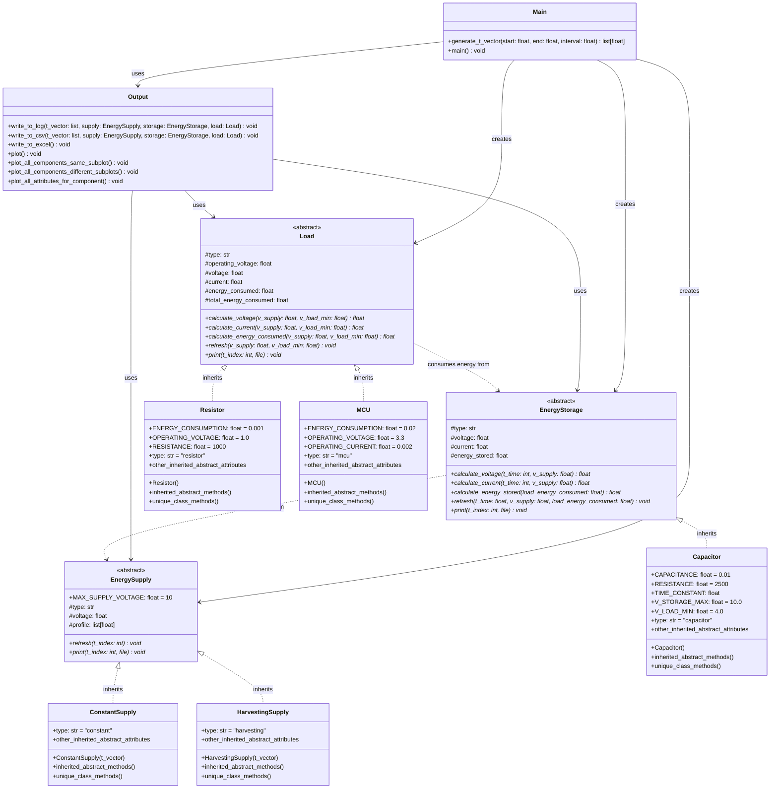

```mermaid
classDiagram
direction TB
    %% Abstract Base Classes
    class EnergySupply {
        <<abstract>>
        +MAX_SUPPLY_VOLTAGE: float = 10
        #type: str
        #voltage: float
        #profile: list[float]
        +refresh(t_index: int)* void
        +print(t_index: int, file)* void
    }

    class EnergyStorage {
        <<abstract>>
        #type: str
        #voltage: float
        #current: float
        #energy_stored: float
        +calculate_voltage(t_time: int, v_supply: float)* float
        +calculate_current(t_time: int, v_supply: float)* float
        +calculate_energy_stored(load_energy_consumed: float)* float
        +refresh(t_time: float, v_supply: float, load_energy_consumed: float)* void
        +print(t_index: int, file)* void
    }

    class Load {
        <<abstract>>
        #type: str
        #operating_voltage: float
        #voltage: float
        #current: float
        #energy_consumed: float
        #total_energy_consumed: float
        +calculate_voltage(v_supply: float, v_load_min: float)* float
        +calculate_current(v_supply: float, v_load_min: float)* float
        +calculate_energy_consumed(v_supply: float, v_load_min: float)* float
        +refresh(v_supply: float, v_load_min: float)* void
        +print(t_index: int, file)* void
    }

    %% Example Energy Supply Classes
    class ConstantSupply {
        +type: str = "constant"
        +other_inherited_abstract_attributes
        +ConstantSupply(t_vector)
        +inherited_abstract_methods()
        +unique_class_methods()
    }

    class HarvestingSupply {
        +type: str = "harvesting"
        +other_inherited_abstract_attributes
        +HarvestingSupply(t_vector)
        +inherited_abstract_methods()
        +unique_class_methods()
    }

    %% Example Energy Storage Classes
    class Capacitor {
        +CAPACITANCE: float = 0.01
        +RESISTANCE: float = 2500
        +TIME_CONSTANT: float
        +V_STORAGE_MAX: float = 10.0
        +V_LOAD_MIN: float = 4.0
        +type: str = "capacitor"
        +other_inherited_abstract_attributes
        +Capacitor()
        +inherited_abstract_methods()
        +unique_class_methods()
    }

    %% Example Load Classes
    class Resistor {
        +ENERGY_CONSUMPTION: float = 0.001
        +OPERATING_VOLTAGE: float = 1.0
        +RESISTANCE: float = 1000
        +type: str = "resistor"
        +other_inherited_abstract_attributes
        +Resistor()
        +inherited_abstract_methods()
        +unique_class_methods()
    }

    class MCU {
        +ENERGY_CONSUMPTION: float = 0.02
        +OPERATING_VOLTAGE: float = 3.3
        +OPERATING_CURRENT: float = 0.002
        +type: str = "mcu"
        +other_inherited_abstract_attributes
        +MCU()
        +inherited_abstract_methods()
        +unique_class_methods()
    }

    %% Main Classes
    class Main {
        +generate_t_vector(start: float, end: float, interval: float) list[float]
        +main() void
    }

    class Output {
        +write_to_log(t_vector: list, supply: EnergySupply, storage: EnergyStorage, load: Load) void
        +write_to_csv(t_vector: list, supply: EnergySupply, storage: EnergyStorage, load: Load) void
        +write_to_excel() void
        +plot() void
        +plot_all_components_same_subplot() void
        +plot_all_components_different_subplots() void
        +plot_all_attributes_for_component() void
    }

    %% Inheritance Relationships
    EnergySupply <|.. ConstantSupply : inherits
    EnergySupply <|.. HarvestingSupply : inherits
    EnergyStorage <|.. Capacitor : inherits
    Load <|.. Resistor : inherits
    Load <|.. MCU : inherits

    %% Composition/Usage Relationships
    Main --> EnergySupply : creates
    Main --> EnergyStorage : creates
    Main --> Load : creates
    Main --> Output : uses
    Output --> EnergySupply : uses
    Output --> EnergyStorage : uses
    Output --> Load : uses

    %% Energy Flow Dependencies
    EnergyStorage ..> EnergySupply : receives energy from
    Load ..> EnergyStorage : consumes energy from
```