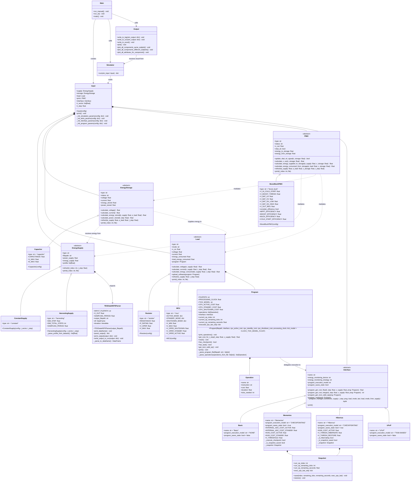

```mermaid
classDiagram
direction TB
    %% Abstract Base Classes
    class EnergySupply {
        <<abstract>>
        +type: str
        +filepath: str
        +power_supply: float
        +energy_supply: float
        +profile: list[float]
        +refresh(t_index: int, t_step: float)
        +print(t_index: int, file)
    }

    class EnergyStorage {
        <<abstract>>
        +type: str
        +status: str
        +voltage: float
        +current: float
        +energy_stored: float
        +power_stored: float
        +calculate_voltage()* float
        +calculate_current()* float
        +calculate_energy_stored(e_supply: float, e_load: float)* float
        +calculate_power_stored(t_step: float)* float
        +refresh(e_supply: float, e_load: float, t_step: float)
        +print(t_index: int, file)
    }

    class Load {
        <<abstract>>
        +type: str
        +mode: str
        +v_on: float
        +voltage: float
        +current: float
        +energy_consumed: float
        +total_energy_consumed: float
        +program: Program
        +calculate_voltage(v_supply: float)* float
        +calculate_current(v_supply: float, t_step: float)* float
        +calculate_energy_consumed(v_supply: float, t_step: float)* float
        +upload_software(program: Program)
        +refresh(v_supply: float, t_step: float)
        +print(t_index: int, file)
    }

    class PMIC {
        <<abstract>>
        +type: str
        +status: str
        +v_out: float
        +vbat_ok: bool
        +energy_to_storage: float
        +energy_from_storage: float
        +update_vbat_ok_signal(v_storage: float)* bool
        +calculate_v_out(v_storage: float)* float
        +calculate_energy_supplied_to_storage(e_supply: float, v_storage: float)* float
        +calculate_energy_consumed_from_storage(e_load: float, v_storage: float)* float
        +refresh(e_supply: float, e_load: float, v_storage: float, t_step: float)
        +print(t_index: int, file)
    }

    class Interface {
        <<abstract>>
        +name: str
        +energy_monitoring_device: str
        +energy_monitoring_strategy: str
        +program_execution_model: str
        +program_saves_state: bool
        +program_get_cost_float(t_step: float, v_supply: float, prog: Program)* float
        +program_get_cost_integer(t_step: float, v_supply: float, prog: Program)* int
        +program_get_next_valid_op(prog: Program)
        +program_reset(prog: Program)
        +program_manage_execution(v_supply, t_step, prog, load_mode_last, load_mode_from_supply)* tuple
        +print()
    }

    %% Energy Supply Implementations
    class ConstantSupply {
        +type: str = "constant"
        +ConstantSupply(config, t_vector, t_step)
    }

    class HarvestingSupply {
        +type: str = "harvesting"
        +SIM_STEP: float
        +SIM_TOTAL_STEPS: int
        +SAMPLING_PERIOD: float
        +HarvestingSupply(config, t_vector, t_step)
        -_parse_profile_from_dataset() list[float]
    }

    %% Energy Storage Implementations
    class Capacitor {
        +type: str = "capacitor"
        +CAPACITANCE: float
        +V_MAX: float
        +E_MAX: float
        +Capacitor(config)
    }

    %% Load Implementations
    class Resistor {
        +type: str = "resistor"
        +RESISTANCE: float
        +P_RATING: float
        +V_OPER: float
        +V_MAX: float
        +Resistor(config)
    }

    class MCU {
        +type: str = "mcu"
        +ACTIVE_MODE: dict
        +STANDBY_MODE: dict
        +SHUTDOWN_MODE: dict
        +V_MIN: float
        +V_MAX: float
        +V_OPER_SHUTDOWN: float
        +V_OPER_STANDBY: float
        +V_OPER_ACTIVE: float
        +MCU(config)
    }

    %% PMIC Implementations
    class BoostBuckPMIC {
        +type: str = "boost_buck"
        +V_IN_COLD_START: float
        +V_BOOST_THRESH: float
        +V_BAT_UV: float
        +V_BAT_OV: float
        +V_BAT_OK_LOW: float
        +V_BAT_OK_HIGH: float
        +V_OUT_REG: float
        +consider_efficiency: bool
        +MPPT_EFFICIENCY: float
        +BOOST_EFFICIENCY: float
        +BUCK_EFFICIENCY: float
        +COLD_START_EFFICIENCY: float
        +BoostBuckPMIC(config)
    }

    %% Interface Implementations
    class Basic {
        +name: str = "Basic"
        +program_execution_model: str = "NONE"
        +program_saves_state: bool = false
    }

    class Mementos {
        +name: str = "Mementos"
        +program_execution_model: str = "CHECKPOINTING"
        +program_saves_state: bool = true
        +INTERNAL_ADC_COST_ACTIVE: float
        +INTERNAL_ADC_COST_STANDBY: float
        +NVM_COST_ACTIVE: float
        +NVM_COST_STANDBY: float
        +V_THRESHOLD: float
        -_execute_checkpoint: bool
        -_is_snapshot_saved: bool
        -_snapshot: Snapshot
    }

    class Hibernus {
        +name: str = "Hibernus"
        +program_execution_model: str = "CHECKPOINTING"
        +program_saves_state: bool = true
        +NVM_COST_ACTIVE: float
        +V_THRESH_HIBERNATE: float
        +V_THRESH_RESTORE: float
        -_is_hibernating: bool
        -_is_snapshot_saved: bool
        -_snapshot: Snapshot
    }

    class UFoP {
        +name: str = "UFoP"
        +program_execution_model: str = "TASK-BASED"
        +program_saves_state: bool = false
    }

    %% Supporting Classes
    class Program {
        +FILEPATH: str
        +PROCESSING_CLOCK: float
        +TICK_MODEL: str
        +CPU_ACTIVE_COST: float
        +CPU_STANDBY_COST: float
        +CPU_SHUTDOWN_COST: float
        +operations: list[Operation]
        +interface: Interface
        +current_op_index: int
        +current_op_remaining_ticks: int
        +current_op_remaining_seconds: float
        +executed_ops_last_step: dict
        +Program(filepath, interface, cpu_active_cost, cpu_standby_cost, cpu_shutdown_cost, processing_clock, tick_model = CLOCK_TICK_MODEL_FLOAT)
        +print_operations() void
        +get_cost_for_t_step(t_step: float, v_supply: float) float
        +reset() void
        +has_checkpoint() bool
        +has_task() bool
        +get_next_valid_op() void
        +print() void
        -_parse_program_file(filepath: str) list[str]
        -_parse_operations(operations_from_file: list[str]) list[Operation]
    }

    class Operation {
        +name: str
        +instruction: str
        +cost: float
        +duration: float
        +ticks_needed: int
    }

    class Snapshot {
        +curr_op_index: int
        +curr_op_remaining_ticks: int
        +curr_op_remaining_seconds: float
        +exec_ops_last_step: dict
        +save(index, remaining_ticks, remaining_seconds, exec_ops_last) void
        +restore() void
    }

    class Input {
        +supply: EnergySupply
        +storage: EnergyStorage
        +load: Load
        +pmic: PMIC
        +interface: Interface
        +t_vector: list[float]
        +t_step: float
        +Input(config)
        +print() void
        -_init_simulation_params(config: dict) void
        -_init_behs_params(config: dict) void
        -_init_interface_params(config: dict) void
        -_init_program_params(config: dict) void
    }

    class Simulator {
        +run(sim_input: Input) dict
    }

    class Main {
        +run_manual() void
        +run_ui() void
        +main() void
    }

    class Output {
        +write_to_log(sim_output: dict) void
        +write_to_csv(sim_output: dict) void
        +write_to_excel() void
        +plot() void
        +plot_all_components_same_subplot() void
        +plot_all_components_different_subplots() void
        +plot_all_attributes_for_component() void
    }

    class TEGDataHDF5Parser {
        +INPUT_FILEPATH: str
        +V_OUT: float
        +SAMPLING_PERIOD: float
        +output_filepath: str
        +df: DataFrame
        +duration: timedelta
        +TEGDataHDF5Parser(output_filepath)
        +print_dataframe() void
        +parse_output() dict
        +print_output(output: dict) void
        +write_output_to_csv(output: dict) void
        -_parse_to_dataframe() DataFrame
    }

    %% Inheritance
    EnergySupply <|-- ConstantSupply
    EnergySupply <|-- HarvestingSupply
    EnergyStorage <|-- Capacitor
    Load <|-- Resistor
    Load <|-- MCU
    PMIC <|-- BoostBuckPMIC
    Interface <|-- Basic
    Interface <|-- Mementos
    Interface <|-- Hibernus
    Interface <|-- UFoP

    %% Composition
    Input *-- EnergySupply
    Input *-- EnergyStorage
    Input *-- Load
    Input *-- PMIC
    Load *-- Program
    Program *-- Operation
    Program --> Interface : delegates execution to
    Mementos *-- Snapshot
    Hibernus *-- Snapshot
    EnergySupply *--> TEGDataHDF5Parser : imports

    %% Usage
    Main --> Input : creates
    Main --> Simulator : calls
    Main --> Output : calls
    Simulator --> Input : reads
    Output --> Simulator : receives result from
    Input *-- Interface

    %% Energy Flow
    EnergyStorage ..> EnergySupply : receives energy from
    EnergyStorage ..> Load : supplies energy to
    PMIC ..> EnergySupply : mediates
    PMIC ..> EnergyStorage : mediates
    PMIC ..> Load : mediates
```